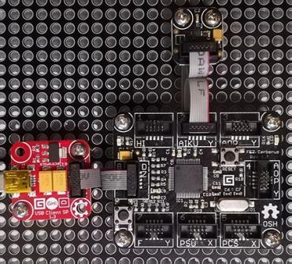

# AccelG248 modules
Version: __0.9.0__

## Connections ##
AccelG248 is connected as followed on [Cerberus](http://docs.ghielectronics.com/hardware/legacy_products/gadgeteer/fez_cerberus.html):



AccelG248    | Mainboard
------------- | ----------
Socket Type I | Socket 2

## Example of code:
```CSharp
using System.Diagnostics;
using System.Threading;
using Bauland.Gadgeteer;
using GHIElectronics.TinyCLR.Pins;

namespace TestAccelG248
{
    static class Program
    {
        static void Main()
        {
            // AccelG248 connected on Socket 2 (Type I) of FEZ Cerberus mainboard.
            AccelG248 accelG248 = new AccelG248(FEZCerberus.I2cBus.Socket2);

            while (true)
            {
                accelG248.GetAcceleration(out var x,out var y, out var z);
                Debug.WriteLine("Accel. X: "+x.ToString("F1")+", Y: "+y.ToString("F1")+", Z: "+z.ToString("F1"));
                Thread.Sleep(500);
            }
        }
    }
}

```
