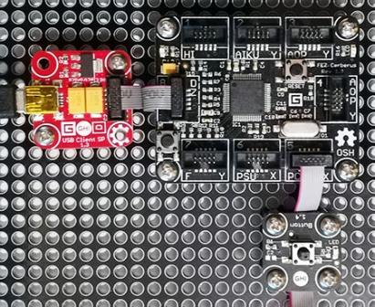

# Button modules
Version: __0.9.0__

## Connections ##
Button is connected as followed on [Cerberus](http://docs.ghielectronics.com/hardware/legacy_products/gadgeteer/fez_cerberus.html):



Button        | Mainboard
------------- | ----------
Socket Type X | Socket 5

## Example of code:
```CSharp
using System.Threading;
using Bauland.Gadgeteer;
using GHIElectronics.TinyCLR.Pins;

namespace TestButton
{
    static class Program
    {
        private static Button _button;
        static void Main()
        {
            // Button connected on Socket 4 (Type X) of FEZ Cerberus mainboard.
            _button = new Button(FEZCerberus.GpioPin.Socket5.Pin3, FEZCerberus.GpioPin.Socket5.Pin4);

            // Set light on button
            _button.Led = true;
            Thread.Sleep(1000);
            _button.Led = false;
            Thread.Sleep(1000);

            // Get button action
            _button.Pressed += Button_Pressed;
            _button.Released += Button_Released;
            _button.LongPressed += Button_LongPressed;

            while (true)
            {
                Thread.Sleep(20);
            }
        }

        private static void Button_LongPressed(object sender, ButtonEventHandlerArgs args)
        {
            for (int i = 0; i < 3; i++)
            {
                _button.Led = true;
                Thread.Sleep(100);
                _button.Led = false;
                Thread.Sleep(100);
            }
        }

        private static void Button_Released(object sender, ButtonEventHandlerArgs args)
        {
            _button.Led = false;
        }

        private static void Button_Pressed(object sender, ButtonEventHandlerArgs args)
        {
            _button.Led = true;
        }
    }
}
```
