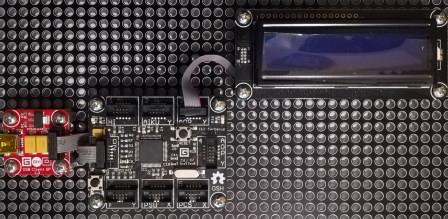

# CharacterDisplay modules
Version: __0.8.0__

## Connections ##
CharacterDisplay is connected as followed on [Cerberus](http://docs.ghielectronics.com/hardware/legacy_products/gadgeteer/fez_cerberus.html):



CharacterDisplay | Mainboard
---------------- | ----------
Socket Type Y    | Socket 3

## Example of code:
```CSharp
using System.Threading;
using Bauland.Gadgeteer;
using GHIElectronics.TinyCLR.Pins;

namespace TestCharacterDisplay
{
    static class Program
    {
        static void Main()
        {
            // CharacterDisplay connected on Socket 3 (Type I) of FEZ Cerberus mainboard.
            CharacterDisplay characterDisplay =
                new CharacterDisplay(FEZCerberus.GpioPin.Socket3.Pin3,
                    FEZCerberus.GpioPin.Socket3.Pin4, FEZCerberus.GpioPin.Socket3.Pin5,
                    FEZCerberus.GpioPin.Socket3.Pin6, FEZCerberus.GpioPin.Socket3.Pin7,
                    FEZCerberus.GpioPin.Socket3.Pin8, FEZCerberus.GpioPin.Socket3.Pin9)
                {
                    BacklightEnabled = true
                };
            characterDisplay.Clear();

            int i = 0;
            while (true)
            {
                i++;
                characterDisplay.CursorHome();
                characterDisplay.Print("Value:" + i);
                Thread.Sleep(500);
            }
        }
    }
}
```
