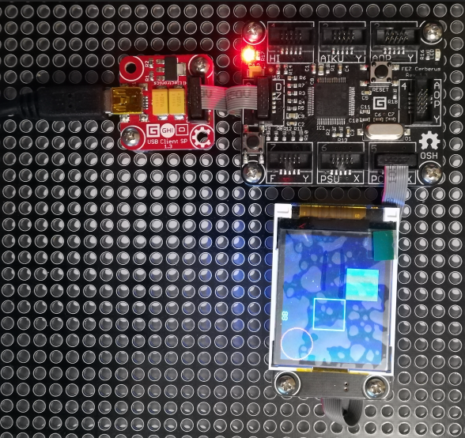

# Gadgeteer N18Display modules
Version: __0.7.0__

## Connections ##
N18Display is connected as followed on [Cerberus](http://docs.ghielectronics.com/hardware/legacy_products/gadgeteer/fez_cerberus.html):



N18Display    | Mainboard
------------- | ----------
Socket Type S | Socket 5

Socket 6 seems to be problematic.

## Example of code:
```CSharp
using System.Threading;
using Bauland.Gadgeteer;
using GHIElectronics.TinyCLR.Pins;

namespace TestN18Display
{
    static class Program
    {
        static void Main()
        {
            DisplayN18 display = new DisplayN18(FEZCerberus.GpioPin.Socket5.Pin3, FEZCerberus.GpioPin.Socket5.Pin4,
                FEZCerberus.GpioPin.Socket5.Pin5, FEZCerberus.SpiBus.Socket5, FEZCerberus.GpioPin.Socket5.Pin6);

            display.TurnOn();

            short i = 0;
            while (true)
            {
                i++;
                display.DrawText(50, 0, i.ToString("X"), Color.Green);
                display.DrawCircle(20, 20, 20, Color.Red);
                display.DrawRectangle(40, 40, 40, 40, Color.Cyan);
                display.DrawFilledRectangle(80, 80, 40, 40, Color.Blue);

                Thread.Sleep(500);
            }
            // ReSharper disable once FunctionNeverReturns
        }
    }
}
```
