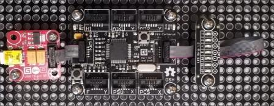

# LedStrip modules
Version: __0.8.0__

## Connections ##
LedStrip is connected as followed on [Cerberus](http://docs.ghielectronics.com/hardware/legacy_products/gadgeteer/fez_cerberus.html):



LedStrip    | Mainboard
------------- | ----------
Socket Type Y | Socket 4

## Example of code:
```CSharp
using System.Threading;
using Bauland.Gadgeteer;
using GHIElectronics.TinyCLR.Pins;

namespace Test_LedStrip
{
    static class Program
    {
        static void Main()
        {
            // LedStrip connected on Socket 4 (Type Y) of FEZ Cerberus mainboard.
            LedStrip ledStrip = new LedStrip(FEZCerberus.GpioPin.Socket4.Pin3, FEZCerberus.GpioPin.Socket4.Pin4, FEZCerberus.GpioPin.Socket4.Pin5, FEZCerberus.GpioPin.Socket4.Pin6, FEZCerberus.GpioPin.Socket4.Pin7, FEZCerberus.GpioPin.Socket4.Pin8, FEZCerberus.GpioPin.Socket4.Pin9);
            while (true)
            {
                // Set individual state of led
                for (int i = 0; i < 7; i++)
                {
                    if (i == 0)
                    {
                        ledStrip.SetLed(6, false);
                        ledStrip.SetLed(i, true);
                    }
                    else
                    {
                        ledStrip.SetLed(i - 1, false);
                        ledStrip.SetLed(i, true);
                    }
                    Thread.Sleep(500);
                }

                // Set group state of led
                for (int i = 0; i < 7; i++)
                {
                    ledStrip.SetToLed(i);
                    Thread.Sleep(500);
                }
            }
        }
    }
}
```
