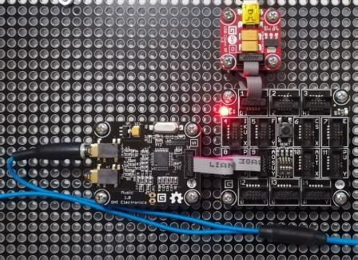

# Music modules
Version: __0.7.0__

## Connections ##
Music is connected as followed on [FEZSpiderII](http://docs.ghielectronics.com/hardware/legacy_products/gadgeteer/fez_spider_ii.html):



Music | Mainboard
---------------- | ----------
Socket Type S    | Socket 9

## Example of code:
```CSharp
using System.Threading;
using Bauland.Gadgeteer;
using GHIElectronics.TinyCLR.Pins;
using testStreamResource.Properties;

namespace testStreamResource
{
    static class Program
    {
        static void Main()
        {
            // Load file from resources project
            byte[] mp3 = Resources.GetBytes(Resources.BinaryResources.mpthreetest);
            // Music is connected on Socket 9 (Type S) of FEZSpider II mainboard.
            Music music = new Music(FEZSpiderII.GpioPin.Socket9.Pin3, FEZSpiderII.SpiBus.Socket9, FEZSpiderII.GpioPin.Socket9.Pin5, FEZSpiderII.GpioPin.Socket9.Pin6);

            while (true)
            {
                music.SetVolume(150, 150);
                music.RunSineTest();
                Thread.Sleep(2000);
                music.StopPlaying();
                music.SetVolume(255, 255);
                music.Play(mp3);
                while (music.IsBusy)
                {
                    Thread.Sleep(20);
                }
                Thread.Sleep(1000);
            }
        }
    }
}
```
