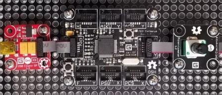

# Potentiometer modules
Version: __0.8.0__

## Connections ##
Potentiometer is connected as followed on [Cerberus](http://docs.ghielectronics.com/hardware/legacy_products/gadgeteer/fez_cerberus.html):



Potentiometer    | Mainboard
------------- | ----------
Socket Type A | Socket 4

## Example of code:
```CSharp
using System.Diagnostics;
using System.Threading;
using Bauland.Gadgeteer;
using GHIElectronics.TinyCLR.Pins;

namespace TestPotentiometer
{
    static class Program
    {
        static void Main()
        {
            // Potentiometer connected on Socket 4 (Type A) of FEZ Cerberus mainboard.
            Potentiometer potentiometer=new Potentiometer(FEZCerberus.AdcChannel.Socket4.Pin3);

            while (true)
            {
                Debug.WriteLine("Potentiometer voltage: "+potentiometer.ReadVoltage()+"V, percentage:"+(potentiometer.ReadProportion()*100).ToString("F1")+"%");
                Thread.Sleep(500);
            }
        }
    }
}
```
