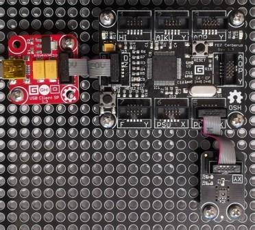

# TempHumid modules
Version: __0.8.0__

## Connections ##
TempHumid is connected as followed on [Cerberus](http://docs.ghielectronics.com/hardware/legacy_products/gadgeteer/fez_cerberus.html):



TempHumid    | Mainboard
------------- | ----------
Socket Type X or Y | Socket 5

## Example of code:
```CSharp
using System.Diagnostics;
using System.Threading;
using Bauland.Gadgeteer;
using GHIElectronics.TinyCLR.Pins;

namespace TestTempHumid
{
    static class Program
    {
        static void Main()
        {
            // TempHumid connected on Socket 5 (Type X or Y) of FEZ Cerberus mainboard.
            TempHumidity tempHumidity=new TempHumidity(FEZCerberus.GpioPin.Socket5.Pin4,FEZCerberus.GpioPin.Socket5.Pin5);
            tempHumidity.MeasurementComplete += TempHumidity_MeasurementComplete;
            tempHumidity.MeasurementInterval = 1000;
            tempHumidity.StartTakingMeasurements();

            while (true)
            {
                Thread.Sleep(20);
            }
        }

        private static void TempHumidity_MeasurementComplete(TempHumidity sender, TempHumidity.MeasurementCompleteEventArgs e)
        {
            Debug.WriteLine("Temperature: "+e.Temperature.ToString("F1")+"°C, Humidity: "+e.RelativeHumidity.ToString("F1")+"%");
        }
    }
}
```
