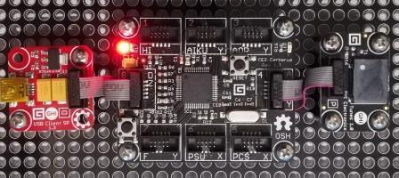

# Tunes modules
Version: __0.9.0__

## Connections ##
Tunes is connected as followed on [Cerberus](http://docs.ghielectronics.com/hardware/legacy_products/gadgeteer/fez_cerberus.html):



Tunes         | Mainboard
------------- | ----------
Socket Type P (pwm on __pin9__) | Socket 4

## Example of code:
```CSharp
using System.Threading;
using Bauland.Gadgeteer;
using GHIElectronics.TinyCLR.Pins;

namespace TestTunes
{
    static class Program
    {
        static void Main()
        {
            // Tunes connected on Socket 4 (Type P) of FEZ Cerberus mainboard.
            Tunes tunes = new Tunes(FEZCerberus.PwmPin.Controller3.Id, FEZCerberus.PwmPin.Controller3.Socket4.Pin9);
            int duration = 400;
            int durationRest = 20;

            Melody melody = new Melody(
                new MusicNote(Tone.G3, duration), new MusicNote(Tone.Rest, durationRest), new MusicNote(Tone.G3, duration), new MusicNote(Tone.Rest, durationRest), new MusicNote(Tone.G3, duration), new MusicNote(Tone.Rest, durationRest), 
                new MusicNote(Tone.G3, duration), new MusicNote(Tone.Rest, durationRest), new MusicNote(Tone.B3, duration), new MusicNote(Tone.Rest, durationRest), new MusicNote(Tone.G3, duration), new MusicNote(Tone.Rest, durationRest), 
                new MusicNote(Tone.A3, duration), new MusicNote(Tone.Rest, durationRest), new MusicNote(Tone.A3, duration), new MusicNote(Tone.Rest, durationRest), new MusicNote(Tone.A3, duration), new MusicNote(Tone.Rest, durationRest), 
                new MusicNote(Tone.A3, duration), new MusicNote(Tone.Rest, durationRest), new MusicNote(Tone.C4, duration));
            tunes.Play(melody);

            while (true)
            {
                Thread.Sleep(20);
            }
        }
    }
}
```
