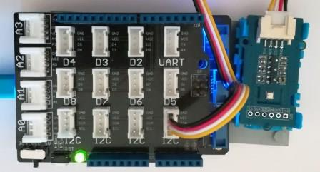

# Grove BarometerSensorBME280 modules
Version: __0.9.0__

## Connections ##
Grove BarometerSensorBME280 is connected as followed on [Netduino3](http://developer.wildernesslabs.co/Netduino/About/):



Grove BarometerSensorBME280 | Mainboard with base shield
---------------- | ----------
 I2C | Socket I2C

## Example of code:
```CSharp
using System.Diagnostics;
using System.Threading;
using Bauland.Grove;
using Bauland.Pins;

namespace TestBarometerBME280
{
    static class Program
    {
        static void Main()
        {
            // Barometer module is connected on I2C bus of Netduino 3
            BarometerSensorBme280 barometer = new BarometerSensorBme280(Netduino3.I2cBus.I2c);

            while (true)
            {
                var temperature = barometer.GetTemperature();
                var pressure = barometer.GetPressure();
                var altitude = barometer.CalculateAltitude(pressure);
                var humidity = barometer.GetHumidity();
                Debug.WriteLine("Temperature: " + temperature.ToString("F1") + " °C, " +
                                "Pressure: " + (pressure / 100.0).ToString("F1") + " hPa, " +
                                "Altitude: " + altitude.ToString("F1") + " m, " +
                                "Humidity: " + humidity.ToString("F1") + " %");
                Thread.Sleep(1000);
            }
        }
    }
}
```
