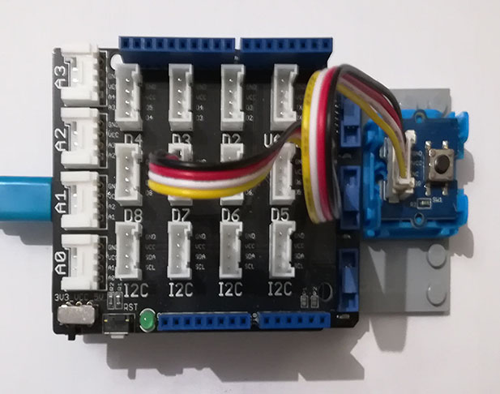

# Grove Button modules
Version: __0.9.0__

## Connections ##
Grove Button is connected as followed on [Netduino3](http://docs.ghielectronics.com/hardware/legacy_products/gadgeteer/fez_cerberus.html):



Grove Button     | Mainboard with base shield
---------------- | ----------
Yellow wire      | Socket D7

## Example of code:
```CSharp
using System.Threading;
using Bauland.Grove;
using Bauland.Pins;
using GHIElectronics.TinyCLR.Devices.Gpio;

namespace TestButton
{
    internal static class Program
    {
        private static GpioPin _led;

        private static void Main()
        {
            _led = GpioController.GetDefault().OpenPin(Netduino3.GpioPin.Led);
            _led.SetDriveMode(GpioPinDriveMode.Output);
            _led.Write(GpioPinValue.Low);

            // Button Grove module is connected as follow:
            // * yellow wire on D7
            // on a base shield connected on Netduino3 


            Button btn=new Button(Netduino3.GpioPin.D7);
            btn.ButtonPressed += Btn_ButtonPressed;
            btn.ButtonReleased += Btn_ButtonReleased;
            while (true)
            {
                Thread.Sleep(500);
            }
        }

        private static void Btn_ButtonReleased()
        {
            _led.Write(GpioPinValue.Low);
        }

        private static void Btn_ButtonPressed()
        {
            _led.Write(GpioPinValue.High);
        }
    }
}
```
