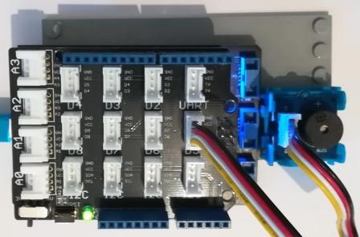

# Grove Buzzer modules
Version: __0.9.0__

## Connections ##
Grove Buzzer is connected as followed on [Netduino3](http://docs.ghielectronics.com/hardware/legacy_products/gadgeteer/fez_cerberus.html):



Grove Buzzer  | Mainboard
---------------- | ----------
Yellow wire    | Socket D5 (D5)

## Example of code:
```CSharp
using System.Threading;
using Bauland.Grove;
using Bauland.Pins;

namespace TestBuzzer
{
    static class Program
    {
        static void Main()
        {
            // Buzzer module is connected on pin D5 of Netduino3
            Buzzer buzzer=new Buzzer(Netduino3.GpioPin.D5);

            while (true)
            {
                buzzer.TurnOn();
                Thread.Sleep(500);
                buzzer.TurnOff();
                Thread.Sleep(2000);
                buzzer.Beep();
                Thread.Sleep(2000);
            }
        }
    }
}
```
