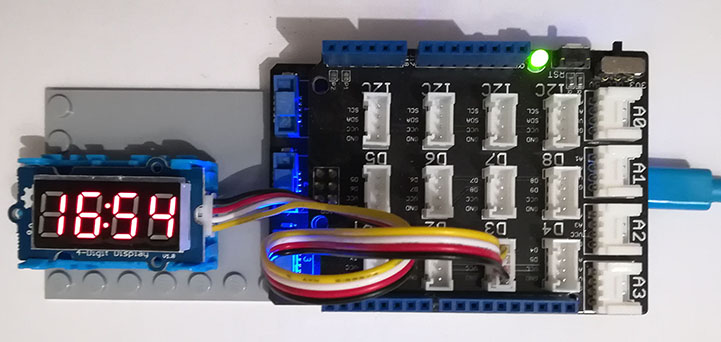

# Grove FourDigitDisplay modules
Version: __0.8.0__

## Connections ##
Grove FourDigitDisplay is connected as followed on [Netduino3](http://docs.ghielectronics.com/hardware/legacy_products/gadgeteer/fez_cerberus.html):



Grove FourDigitDisplay  | Mainboard
---------------- | ----------
Yellow wire    | Socket D3 (D3)
White wire    | Socket D3 (D4)

## Example of code:
```CSharp
using System;
using System.Threading;
using Bauland.Grove;
using Bauland.Pins;

namespace TestFourDigitDisplay
{
    static class Program
    {
        private static void Main()
        {
            // FourDigitDisplay Grove module is connected as follow:
            // * yellow wire on D3
            // * white  wire on D4
            // on a base shield connected on Netduino3 

            FourDigitDisplay fdd = new FourDigitDisplay(Netduino3.GpioPin.D3, Netduino3.GpioPin.D4);

            fdd.SetBrightness(FourDigitDisplay.Brightness.Pw01);

            while (true)
            {
                DateTime dt = DateTime.Now;
                fdd.SetPoint(dt.Second % 2 == 0);
                fdd.Display(dt.Minute / 10, dt.Minute % 10, dt.Second / 10, dt.Second % 10);
                Thread.Sleep(20);
            }
        }
    }
}
```
