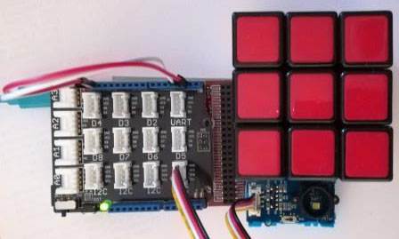

# Grove I2cColorSensor modules
Version: __0.8.0__

## Connections ##
Grove I2cColorSensor is connected as followed on [FEZ Panda III](https://old.ghielectronics.com/catalog/product/474):
__SDA and SCL must be rewire to D2 and D3 for FEZ Panda III (red and white wire).__


Grove I2cColorSensor  | Mainboard
---------------- | ----------
I2C Socket    | I2C Socket 

__LED is ON and distance is around to 1cm to test color face of cube__.

## Example of code:
```CSharp
using System.Diagnostics;
using System.Threading;
using Bauland.Grove;
using GHIElectronics.TinyCLR.Pins;

namespace TestI2CColorSensor
{
    static class Program
    {
        static void Main()
        {
            // I2CColorSensor module is connected on a I2C connector of base shield module in top of FEZPandaIII
            I2CColorSensor i2CColorSensor = new I2CColorSensor(FEZPandaIII.I2cBus.I2c1)
            {
                LedStatus = true
            };

            while (true)
            {
                // Take a measure and get corrected values
                var res = i2CColorSensor.GetArgb();
                // Take a measure and get raw values
                var raw = i2CColorSensor.GetRawData();
                // Display data
                Debug.WriteLine("Red: 0x" + res[0].ToString("X") + ", Green: 0x" + res[1].ToString("X") + ", Blue: 0x" + res[2].ToString("X") + ", Clear: 0x" + res[3].ToString("X"));
                Debug.WriteLine("Raw data -- Red: 0x" + raw[0].ToString("X") + ", Green: 0x" + raw[1].ToString("X") + ", Blue: 0x" + raw[2].ToString("X") + ", Clear: 0x" + raw[3].ToString("X"));
                // Clear interrupt of sensor to get ready to take another measure
                i2CColorSensor.ClearInterrupt();
                Thread.Sleep(2000);
            }
        }
    }
}

```
