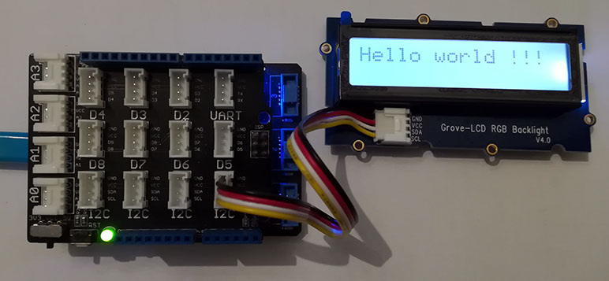

# Grove LcdRgbBacklight modules
Version: __0.8.0__

## Connections ##
Grove LcdRgbBacklight is connected as followed on [Netduino 3](http://www.wildernesslabs.co/Netduino):



Grove LcdRgbBacklight  | Mainboard
---------------- | ----------
I2C Socket    | I2C Socket 

## Example of code:
```CSharp
using System.Threading;
using Bauland.Grove;
using Bauland.Pins;

namespace TestLcdRgbBacklight
{
    static class Program
    {
        static void Main()
        {
            // LcdRgbBacklight module is connected on a I2C connector of base shield module in top of Netduino3

            LcdRgbBacklight lcd=new LcdRgbBacklight(Netduino3.I2cBus.I2c);
            lcd.SetBacklightRgb(64,64,64);
            lcd.EnableDisplay(true);
            lcd.Write("Hello world !!!");

            while (true)
            {
                Thread.Sleep(20);
            }
        }
    }
}
```
