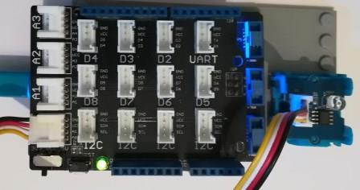

# Grove LightSensor modules
Version: __0.9.0__

## Connections ##
Grove LightSensor is connected as followed on [Netduino3](http://developer.wildernesslabs.co/Netduino/About/):



Grove LightSensor | Mainboard with base shield
---------------- | ----------
Yellow wire | Socket D6

## Example of code:
```CSharp
using System.Diagnostics;
using System.Threading;
using Bauland.Grove;
using Bauland.Pins;

namespace TestLightSensor
{
    static class Program
    {
        static void Main()
        {
            // Grove LightSensor is onnected on A0 pin of Netduino3 board.
            LightSensor lightSensor=new LightSensor(Netduino3.AdcChannel.A0);
            while (true)
            {
                Debug.WriteLine("Light level: "+lightSensor.ReadPercentageLightLevel()+"%.");
                Thread.Sleep(1000);
            }
            // ReSharper disable once FunctionNeverReturns
        }
    }
}
```
