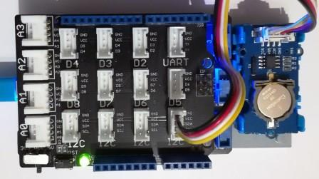

# Grove Rtc modules
Version: __0.9.0__

## Connections ##
Grove Rtc is connected as followed on [Netduino 3](http://developer.wildernesslabs.co/Netduino/About/):



Grove Rtc  | Mainboard
---------------- | ----------
I2C Socket    | I2C Socket 


## Example of code:
```CSharp
using System.Diagnostics;
using System.Threading;
using Bauland.Grove;
using Bauland.Pins;

namespace TestRtc
{
    static class Program
    {
        static void Main()
        {
            // Grove Rtc module is connected on I2C bus of Netduino 3 with base shield
            Rtc rtc = new Rtc(Netduino3.I2cBus.I2c);

            while (true)
            {
                rtc.GetTime();
                Display(rtc);
                Thread.Sleep(1000);
            }
        }

        private static void Display(Rtc rtc)
        {
            Debug.WriteLine("Date: " + rtc.DayOfWeek + " " + rtc.Day + "/" + rtc.Month + "/" + rtc.Year);
            Debug.WriteLine("Time: " + rtc.Hours + ":" + rtc.Minutes + ":" + rtc.Seconds);
        }

        private static void SetTime(Rtc rtc)
        {
            // To set Rtc with winter time
            rtc.GetTime();
            rtc.Hours += 1;
            rtc.SetTime();

            // To set Rtc with specific Date/Time
            rtc.Year = 2018;
            rtc.Month = 02;
            rtc.Day = 23;
            rtc.DayOfWeek = DayOfWeek.Friday;
            rtc.Hours = 18;
            rtc.Minutes = 30;
            rtc.Seconds = 30;
            rtc.SetTime();
        }
    }
}
```
