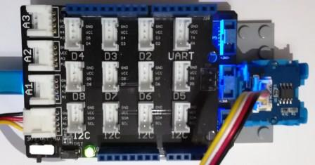

# Grove TemperatureSensor modules
Version: __0.8.0__

## Connections ##
Grove TemperatureSensor is connected as followed on [Netduino3](http://developer.wildernesslabs.co/Netduino/About/):



Grove SoundSensor | Mainboard with base shield
---------------- | ----------
 Yellow wire | Socket A0

## Example of code:
```CSharp
using System.Diagnostics;
using System.Threading;
using Bauland.Grove;
using Bauland.Pins;

namespace TestTemperature
{
    static class Program
    {
        static void Main()
        {
            // Grove TemperatureSensor module is connected on pin A0 of Netduino 3 board with base shield
            TemperatureSensor temperatureSensor = new TemperatureSensor(Netduino3.AdcChannel.A0);

            while (true)
            {
                Debug.WriteLine("Temperature: " + temperatureSensor.ReadTemperature().ToString("F1") + "°C");
                Thread.Sleep(1000);
            }
        }
    }
}
```
