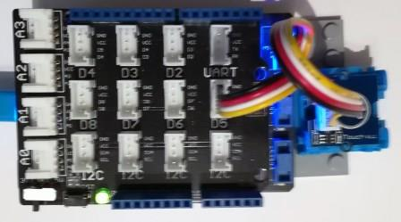

# Grove TouchSensor modules
Version: __0.8.0__

## Connections ##
Grove TouchSensor is connected as followed on [Netduino3](http://developer.wildernesslabs.co/Netduino/About/):



Grove SoundSensor | Mainboard with base shield
---------------- | ----------
 Yellow wire | Socket D5

## Example of code:
```CSharp
using System.Diagnostics;
using System.Threading;
using Bauland.Grove;
using Bauland.Pins;

namespace TestTouchSensor
{
    static class Program
    {
        static void Main()
        {
            // Grove TouchSensor is connected on D5 of Netduino 3 with base shield
            TouchSensor touchSensor=new TouchSensor(Netduino3.GpioPin.D5);

            touchSensor.Touched += TouchSensor_Touched;
            touchSensor.Untouched += TouchSensor_Untouched;

            while (true)
            {
                Thread.Sleep(20);
            }
            // ReSharper disable once FunctionNeverReturns
        }

        private static void TouchSensor_Untouched()
        {
            Debug.WriteLine("Sensor is untouched.");
        }

        private static void TouchSensor_Touched()
        {
            Debug.WriteLine("Sensor is touched.");
        }
    }
}
```
