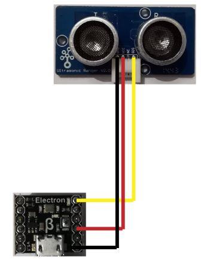

# UltrasonicRanger Grove module
Version: __0.8.0__

## Connections ##
UltrasonicRanger is connected as followed on [Electron](http://www.ingenuitymicro.com/products/electron/):



UltrasonicRanger | Mainboard
-------- | ----------
Gnd | GND
Vcc | 3.3V __(not working on 5V !)__
NC | Not connected
Sig | PA2


## Example of code:
```CSharp
using System.Diagnostics;
using System.Threading;
using Bauland.Grove;

namespace testTinyClrUltrasonicRanger
{
    static class Program
    {
        static void Main()
        {
            UltrasonicRanger ultrasonicRanger = new UltrasonicRanger((0 * 16) + 2)
            {
                // You can change linear coefficient to adjust measure, but it is not mandatory
                A = 0.82f,
                B = 2.10f
            };

            while (true)
            {
                Debug.WriteLine(ultrasonicRanger.ReadCentimeters() + " cm, " + ultrasonicRanger.ReadInches() + " in.");
                Thread.Sleep(500);
            }
        }
    }
}
```
