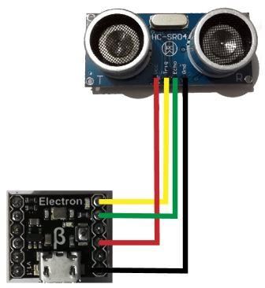

# HC-SR04 modules
Version: __0.7.0__

## Connections ##
HC-SR04 is connected as followed on [Electron](http://www.ingenuitymicro.com/products/electron/):



HC-SR04 | Mainboard
-------- | ----------
GND | GND
Echo | PA3
trig | PA2
Vcc | 3.3V __(not working on 5V !)__


## Example of code:
```CSharp
using System.Diagnostics;
using System.Threading;
using Bauland.Other;

namespace testTinyClrHCSR04
{
    static class Program
    {
        static void Main()
        {
            Hcsr04 hcsr04 = new Hcsr04((0 * 16) + 2, (0 * 16) + 3)
            {
                // You can change linear coefficient to adjust measure, but it is not mandatory
                A = 0.82f,
                B = 2.10f
            };

            while (true)
            {
                Debug.WriteLine(hcsr04.ReadCentimeters() + " cm, " + hcsr04.ReadInches() + " in.");
                Thread.Sleep(500);
            }
        }
    }
}
```
